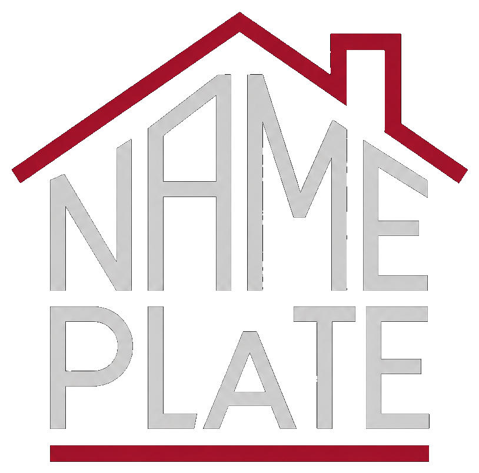
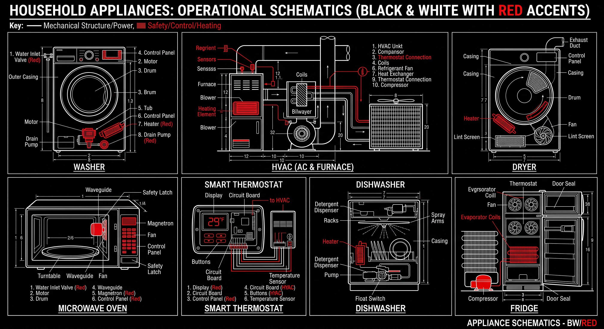

<p align="center">
  
</p>

<h1 align="center">Nameplate</h1>
<p align="center"><em>Every appliance accounted for.</em></p>

<p align="center">
  
</p>

Nameplate is asset-registry and maintenance-tracking software for apartment portfolios. Every major in-unit appliance (washer, dryer, range, HVAC, fridge, water heater) gets a scannable **Nameplate Tag**. Technicians use **Nameplate Field** to scan, inspect, and log service in the field; portfolio managers use **Nameplate HQ** to track every asset, work order, and cost across every property from one console — without visiting a single unit.

---

## ⚡ Current System Capabilities & Status

### 🟢 Fully Working & Verified

| Module | Core Functionality | Status |
|---|---|---|
| **Field Scanner & 1:1 Reticle** | • 1:1 square camera targeting viewfinder with corner crosshairs & laser sweep<br>• Sub-3s offline Crockford-32 checksum & HMAC-SHA256 signature verification<br>• One-tap hardware scan simulation and unassigned tag claiming flow | ✅ Working (`app/lib/screens/scan/`) |
| **Turn Walkthrough & Photo Loop** | • Room-by-room inspection workflow with full 6–8 appliance unit rosters<br>• In-walkthrough photo evidence capture with thumbnail galleries<br>• Pre-submission summary modal with automated SLA-driven work order emission | ✅ Working (`app/lib/screens/turn/`) |
| **Service & Part Harvesting Engine** | • Diagnostic symptom codes & repair logging<br>• Part sourcing: Van Stock (New) vs. Harvest from Donor Unit (cannibalized equipment)<br>• Traceable hardware pedigree links (`sourceAssetId`, `salvagedAt`)<br>• Real-time Repair vs. Replace Cost Estimator (Labor @ $85/hr + parts vs. benchmark)<br>• Automatic work order closure and asset ledger updates | ✅ Working (`app/lib/screens/service/`) |
| **Cryptographic Tag Engine** | • Crockford Base32 check digit minting (`NP-XXXXXXXX`)<br>• Offline HMAC-SHA256 digital seals in compact URIs (`np://t/...`) and web URLs (`https://np.app/a/...`)<br>• 500-tag pre-allocated offline minting pool with refill on sync<br>• Pure Python zero-dependency CLI & 30-tag printable SVG sheet generator (`scripts/nameplate_qr.py`) | ✅ Working (`scripts/`, `app/lib/services/npid.dart`) |
| **HQ Web Console** | • Interactive Asset Ledger with deep lineage timeline<br>• Kanban & List Work Order Dispatcher with SLA countdown timers<br>• Sync Operations Cockpit: live watermark sequence tracker, outbox audit log, printable batch sticker generator with SVG/CSV export, and cryptographic matrix inspector | ✅ Working (`hq/src/`, `website/hq/`) |
| **Backend Sync Engine** | • `POST /v1/sync/pull`: Monotonic sequence delta stream with tombstones<br>• `POST /v1/sync/push`: Idempotent UUIDv7 batch processor for outbox ops & service events<br>• `POST /v1/sync/allocate-block`: Cryptographic pre-allocated 500-tag block generator | ✅ Working (`backend/src/modules/sync/`) |

---

### 🟡 In Progress & Roadmap

| Feature | Target Area | Current State |
|---|---|---|
| **Local SQLite / Drift Mirror** | Field App (`app/`) | In-memory `FieldSession` state is fully functional for all offline flows; local Drift SQLite database tables and automated background network polling worker staged for persistence. |
| **Public Tag Landing Page** | Web Router (`https://np.app/a/:npid`) | Tenant/public mobile web landing page for native camera scans with quick service requests and user manuals. |
| **Multi-Factor Auth & Role Permissions** | Backend & HQ (`backend/`, `hq/`) | Role-based access control (Portfolio Manager, Lead Tech, Field Tech) and session tokens. |

---

## 🏢 Portfolio Context & Properties

<p align="center">
  
  
  
  
</p>

| Property | Units | Core Equipment Standard | Active SLA Profile |
|---|---|---|---|
| **Scottsdale Vista** | 84 Units | Whirlpool Stainless Suite, Carrier HVAC, Rheem 50G Water Heaters | 4h Emergency / 24h Urgent |
| **Sonoran Ridge** | 120 Units | GE EnergyStar Appliance Suite, Trane High-Efficiency Heat Pumps | 4h Emergency / 24h Urgent |
| **Camelback Vista** | 64 Units | Samsung Commercial Stack, Goodman Split HVAC Systems | 4h Emergency / 24h Urgent |
| **Desert Palm** | 96 Units | Frigidaire Pro Kitchen Suite, Rheem Performance Heaters | 4h Emergency / 24h Urgent |

---

## 🛠️ Stack & Repo Layout

| Path | What it is | Test Suite Status |
|---|---|---|
| [`app/`](app) | **Nameplate Field** — Flutter mobile/tablet app for technicians | **16/16 Tests Passing** (`flutter test`, `flutter analyze` clean) |
| [`backend/`](backend) | **Nameplate API** — NestJS + Prisma + PostgreSQL sync engine | **5/5 Jest Tests Passing** (`npm test`, `npm run build` clean) |
| [`hq/`](hq) | **Nameplate HQ** — React + TypeScript web console for managers | **Clean Production Build** (`npm run build` -> `website/hq/`) |
| [`scripts/`](scripts) | **Nameplate QR Engine** — Cryptographic Crockford-32 & SVG tool | **7/7 Python Unit Tests Passing** (`unittest`) |
| [`docs/`](docs) | Architecture, data models, tagging strategy, metrics, and branding | Complete specifications |
| [`website/`](website) | Public marketing site + hosted HQ distribution bundle | Ready to deploy |

---

## 🚀 Running the System

### 1. Flutter Field App (iOS Simulator)
```bash
cd app
flutter pub get
flutter run
```
*Running on iPhone 17 Pro Max (iOS 26.3).*

### 2. Backend API
```bash
cd backend
npm install
npx prisma migrate dev
npx prisma db seed
npm run start:dev
```
*API runs at `http://localhost:3000`.*

### 3. HQ Management Portal
```bash
cd hq
npm install
npm run dev
```
*Web console runs at `http://localhost:5173`.*

### 4. Cryptographic Tag & Sheet Generator
```bash
python3 scripts/nameplate_qr.py mint --batch BATCH-2026-08A
python3 scripts/nameplate_qr.py sheet --count 30 --out sheet_30.svg
```

---

## 📖 Key Documentation
- **Architecture & Sync Strategy**: [`docs/architecture.md`](docs/architecture.md)
- **Data Model & Service Events**: [`docs/data-model.md`](docs/data-model.md)
- **Asset Tagging & Hardware Strategy**: [`docs/asset-tagging-strategy.md`](docs/asset-tagging-strategy.md)
- **Product Scope & Non-Negotiables**: [`docs/v0-scope.md`](docs/v0-scope.md)
- **Brand & Design Language**: [`docs/branding.md`](docs/branding.md)
