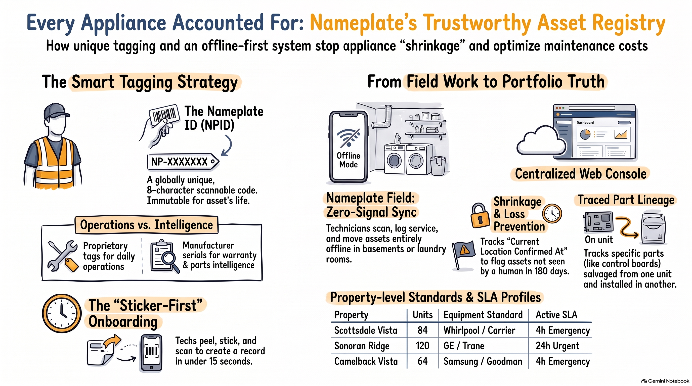

<p align="center">
  
</p>

<h1 align="center">Nameplate</h1>
<p align="center"><em>Every appliance accounted for.</em></p>

Nameplate is the physical asset registry and offline-first maintenance ledger for apartment portfolios. Every major in-unit appliance (refrigerators, ranges, washers, dryers, HVAC split systems, water heaters) is affixed with a tamper-evident, scannable **Nameplate Tag**. 

- **Technicians** use **Nameplate Field** (Flutter) to scan, inspect, harvest donor parts, and log service events even in signal-dead basements and utility closets.
- **Portfolio Managers** use **Nameplate HQ** (React + TypeScript) to track asset lifecycle, dispatch work orders with SLA countdowns, prevent equipment shrinkage, and analyze repair-vs-replace economics across properties.
- **Residents** use **Nameplate Portal** (React + TypeScript) to scan appliance tags, report maintenance requests with photos, and track repair appointments in real time.
- **Backend Platform** (NestJS + Prisma + PostgreSQL production target / Python FastAPI bridge with live Supabase dual-write replication) provides monotonic delta sync, idempotent UUIDv7 batch mutation reconciliation, and cryptographic pre-allocated tag pools. Full visual schema catalog and live status are consolidated in [`website/backend.html`](website/backend.html).

<p align="center">
  
</p>

---

## 🏛️ System Architecture

```
┌───────────────────────────┐                      ┌───────────────────────────┐
│   Nameplate HQ (React)    │                      │  Nameplate Portal (React) │
│  hq.nameplate.app (Vite)  │                      │ portal.nameplate.app(Vite)│
└─────────────┬─────────────┘                      └─────────────┬─────────────┘
              │  REST / JSON (online, per-request)               │  REST / JSON (resident auth,
              │  Portfolio admin, work orders, telemetry         │  tag scan, maintenance tickets)
              │                                                  │
              └─────────────────────┐      ┌─────────────────────┘
                                    ▼      ▼
┌──────────────────────────┐   ┌──────────────────────────────────────┐
│  Nameplate Field         │   │        Nameplate API (NestJS)        │
│  (Flutter, iOS/Android)  │   │  ┌────────────────────────────────┐  │
│                          │   │  │ auth guard / RBAC / org scope  │  │
│  ┌────────────────────┐  │   │  ├────────────────────────────────┤  │
│  │ Drift (SQLite)     │  │   │  │ /v1/*  management endpoints    │  │
│  │  local mirror      │◄─┼───┼──┤ /v1/portal/* resident routes   │  │
│  ├────────────────────┤  │   │  │ /v1/sync/pull  /v1/sync/push   │  │
│  │ outbox (mutations) │──┼──►│  ├────────────────────────────────┤  │
│  │ (UUIDv7, append)   │  │   │  │ domain services (ledger,       │  │
│  ├────────────────────┤  │   │  │  custody, workorder, costing)  │  │
│  │ photo blob queue   │──┼──►│  └───────────────┬────────────────┘  │
│  └────────────────────┘  │   └──────────────────┼───────────────────┘
└──────────────────────────┘                      │ Prisma
        ▲ direct upload                           ▼
        │ (signed URL)                 ┌────────────────────────────┐
        │                              │  PostgreSQL 16 (Supabase)  │
   ┌────┴──────────┐                   │  + read replica (reports)  │
   │ Object storage│                   └────────────────────────────┘
   │  (S3-compat)  │                                │
   └───────────────┘                                ▼
                                       ┌────────────────────────┐
                                       │ Worker (BullMQ + Redis)│
                                       │  metric rollups,       │
                                       │  shrinkage scan, email │
                                       └────────────────────────┘
```

### Architectural Principles & Invariants
1. **Offline-First Append-Only Ledger**: Mobile writes are committed locally first with client-generated **UUIDv7** identifiers and monotonic sequence numbers (`occurred_at` vs. `recorded_at`), ensuring full operation in signal-dead utility rooms without data loss.
2. **Part Harvesting & Genealogy**: Tracks cannibalized parts (`sourceAssetId`, `salvagedAt`) between donor appliances and recipient equipment to maintain true hardware pedigree.
3. **Cryptographic Tag Integrity**: Crockford Base32 identifiers (`NP-XXXXXXXX`) with Luhn mod-32 check digits and HMAC-SHA256 digital signatures for instant offline authenticity verification.
4. **Repair vs. Replace Costing**: Dynamic real-time calculation combining accumulated lifecycle spend, technician labor ($85/hr standard), and part costs against replacement benchmarks.

---

## ⚡ Current Featureset Matrix

### 📱 1. Nameplate Field App (Flutter · iOS, Android, Web)
- **Branded Startup & Splash**: Native splash screen ([`app/lib/screens/splash_screen.dart`](app/lib/screens/splash_screen.dart)) with the official Nameplate logo, 28px dot grid, and animated runtime ledger initialization.
- **High-Performance 1:1 Tag Scanner**: Square reticle with laser sweep animation, instant Crockford-32 check-digit validation, HMAC-SHA256 signature verification, and unassigned tag claiming flow.
- **Turn Walkthrough & Photo Loop**: Room-by-room inspection workflow with full 6–8 appliance unit rosters, photo capture, condition rating, and automated SLA-driven work order emission.
- **Service & Part Harvesting Engine**: Diagnostic symptom code selection, van stock vs. harvested donor unit parts tracking, repair notes, and live repair-vs-replace cost calculator.
- **Adaptive Layout**: Responsive bottom navigation bar on phones and full-height side rail on tablets.
- **Sync Status & Watermarks**: Real-time sync badge indicating outbox mutation count, connection health, and offline status.

### 💻 2. Nameplate HQ Console (React + TypeScript + Vite)
- **Instant Pre-Mount Loader**: Theme-aware dark/light loading screen inside `#root` with the official logo for zero flash during script download.
- **Portfolio Overview & Multi-Property Dashboard**: High-level KPIs across properties (Sonoran Ridge, Scottsdale Vista, Camelback Vista, Desert Palm), asset counts, open work orders, and health metrics.
- **Interactive Asset Registry**: Deep appliance lineage timeline, location history, manufacturer details, replacement cost tracking, and fast search (`⌘K`).
- **Kanban & List Work Order Dispatcher**: Live work order queue categorized by status (`Submitted`, `Scheduled`, `In progress`, `Completed`), urgency badges, and real-time SLA countdown clocks.
- **Fleet Analytics & Intelligence**: Equipment longevity cohorts, annualized maintenance cost curves, brand failure rates, and replacement budget forecasting.
- **Sync Operations Cockpit**: Live watermark sequence tracking, outbox audit log, printable batch sticker generator with SVG/CSV export, and cryptographic matrix inspector.

### 🏠 3. Nameplate Resident / Renter Portal (React + TypeScript + Vite)
- **Zero-Flicker Pre-Mount Loader**: Styled loading state with dark/light logo switching matching the user's active theme.
- **Tag-Linked Issue Submission**: Resident reports link directly to an appliance by scanning the physical tag or selecting from their unit roster.
- **Resident-Safe Work Order Tracking**: Visual progress pipeline (`Submitted` → `Scheduled` → `In progress` → `Completed`) with appointment windows.
- **My Appliances Roster**: In-unit equipment directory featuring high-resolution isometric schematics (`schematics/*.png`) and service timestamps.
- **Safety Triage & Emergency Alerts**: Clear emergency instructions and urgent maintenance flags for active leaks, gas, or HVAC outages.

### ⚙️ 4. Production Backend Platform (NestJS + Prisma + PostgreSQL)
- **Monotonic Sync Delta Stream (`POST /v1/sync/pull`)**: Sequence-based pull endpoint returning all mutations since client watermark with tombstones.
- **Idempotent Outbox Mutation Processor (`POST /v1/sync/push`)**: Batch mutation endpoint for offline service events, asset status updates, and turn checklists.
- **Pre-Allocated Tag Block Allocator (`POST /v1/sync/allocate-block`)**: Allocates batches of 500 pre-signed cryptographic NPIDs to field devices for disconnected tagging.
- **28-Table Relational Domain Schema**: Complete schema with strict referential integrity for Organizations, Properties, Buildings, Units, Assets, Service Events, Part Usages, Parts, Turns, Custody, and Work Orders.
- **Security & Multi-Tenancy**: Supabase JWT authentication, active membership context, permission and property-scope guards, tenant RLS, and private media storage policies.

### 🐍 5. Python FastAPI Sync Gateway & Live Supabase Bridge (`backend_py/`)
- **High-Throughput REST API**: FastAPI server running on Python 3 with SQLAlchemy models, Pydantic v2 schemas, and CORS middleware for local Flutter and web development (`http://localhost:8080`).
- **Live Supabase PostgreSQL Dual-Write**: Real-time event propagation and batch sync hooks mirroring local mutations to live Supabase PostgreSQL (`aifsfmvvcnxowmbuorbx.supabase.co`) via PostgREST with deterministic UUIDv5 mapping (`backend_py/supabase_sync.py`).
- **Offline Batch Ingestion**: Ingestion of offline technician service events, work orders, and asset status updates with conflict resolution and deterministic state reconciliation.
- **Automated Seeding & Cloud Sync**: Production-grade data synchronization scripts (`backend_py/seed_supabase.py`, `backend_py/sync_all_to_supabase.py`) populating the full portfolio and verifying live cloud tables.
- **Comprehensive Test Suite**: Fully automated test coverage across API endpoints, database seeding, and models (**24/24 tests passing** with `pytest`).

### 🏷️ 6. Cryptographic Tag & QR Engine (Python CLI · `scripts/`)
- **Deterministic Minting**: Zero-dependency Python engine ([`scripts/nameplate_qr.py`](scripts/nameplate_qr.py)) implementing Crockford Base32 with Luhn check digits and HMAC-SHA256 signature generation.
- **Printable 30-Tag SVG Sheet**: Generates industrial 30-up sticker sheets (`sheet_30.svg`) formatted for thermal transfer and holographic polyester stock.
- **Tag Verification & URL Parsing**: Resolves compact hardware URIs (`np://t/...`) and public web links (`https://np.app/a/...`).
- **Asset Generation Utilities**: Parametric vector 3D isometric appliance modeler ([`scripts/iso3d_appliances.py`](scripts/iso3d_appliances.py)) and investor deck compiler ([`scripts/build_deck.py`](scripts/build_deck.py)).

### 🌐 7. Interactive Public Web, Tools & Launch Systems (`website/`)
- **Marketing Platform ([`website/index.html`](website/index.html))**: High-impact brand experience with interactive 3D hardware tag visualizer, dual schematic/physical vinyl flipper, live tag minting demo, and CapEx leak breakdown.
- **Consolidated Backend Architecture & Current State ([`website/backend.html`](website/backend.html))**: The unified master backend document. Consolidates the complete 28-table relational catalog across 7 domains, API endpoint maturity matrix, transactional write paths (atomic custody moves, service events), live Supabase cloud sync topology, and implementation roadmap. (*Note: `backend-blueprint.html` redirects here*).
- **Commercial Launch Roadmap & Cost Model ([`website/launch-roadmap.html`](website/launch-roadmap.html))**: Interactive operational budget sizing engine (Apple $99/yr, Supabase Pro $25/mo, Cloud Run $8–$35/mo, 3M vinyl tags $0.18–$0.28/tag), per-unit ROI modeling, 4-week sprint Gantt timeline, and 26-task interactive launch checklist with `localStorage` persistence.
- **Branded Appliance Screensaver ([`website/appliance-idle.html`](website/appliance-idle.html))**: 10-appliance rotating isometric visualizer with keyboard unit-cycling, pause/play, containerless Claude FM 24/7 Lo-Fi live radio telemetry strip, and PiP video monitor.
- **Executive Printable Audit Dossiers ([`website/reports/`](website/reports/))**: Boardroom-ready, printable PDF reports including *Equipment Depreciation & CapEx Replacement Forecast* (`depreciation_audit.html`), *Brand Reliability & Failure Rate Matrix* (`failure_rate_matrix.html`), and *Make-Ready SLA Operations Audit* (`sla_operations_audit.html`).
- **Brand System & UI Spec Sheet ([`website/appliance-shrinkage/`](website/appliance-shrinkage/))**: Complete style guide (colors, typography, containers, appliance isometric line-art, rigid buttons, logo lockups).

---

## 🏢 Portfolio Context & Properties

<p align="center">
  
  
  
  
</p>

| Property | Units | Core Equipment Standard | Active SLA Profile |
|---|---|---|---|
| **Scottsdale Vista** | 84 Units | Whirlpool Stainless Suite, Carrier HVAC, Rheem 50G Water Heaters | 4h Emergency / 24h Urgent |
| **Sonoran Ridge** | 120 Units | GE EnergyStar Appliance Suite, Trane High-Efficiency Heat Pumps | 4h Emergency / 24h Urgent |
| **Camelback Vista** | 64 Units | Samsung Commercial Stack, Goodman Split HVAC Systems | 4h Emergency / 24h Urgent |
| **Desert Palm** | 96 Units | Frigidaire Pro Kitchen Suite, Rheem Performance Heaters | 4h Emergency / 24h Urgent |

---

## 🛠️ Stack & Repository Layout

| Path | Surface / Module | Technology | Test / Build Status |
|---|---|---|---|
| [`app/`](app) | **Nameplate Field** | Flutter 3.x / Dart 3.x, Riverpod | **17/17 Tests Passing** (`flutter test`, `flutter analyze` clean) |
| [`hq/`](hq) | **Nameplate HQ** | React 19, TypeScript, Vite, React Router | **Clean Production Build** (`npm run build` -> `website/hq/`) |
| [`portal/`](portal) | **Nameplate Resident** | React 19, TypeScript, Vite | **Clean Production Build** (`npm run build` -> `website/portal/`) |
| [`backend/`](backend) | **Nameplate API (NestJS)** | NestJS, Prisma ORM, PostgreSQL | **22/22 Tests Passing** (9/9 Jest suites, `npm run build` clean) |
| [`backend_py/`](backend_py) | **Nameplate API (FastAPI)** | Python 3, FastAPI, SQLAlchemy, SQLite/Supabase | **24/24 Tests Passing** (`pytest backend_py/`) |
| [`scripts/`](scripts) | **Tag & QR Generator** | Python 3 (zero dependencies) | **7/7 Python Tests Passing** (`unittest tests/`) |
| [`website/`](website) | **Public Web, Roadmap & Demos** | HTML5, CSS3, Vanilla JS, Hosted Builds | Live static bundle, roadmap calculator, audit reports, idle screensaver |
| [`docs/`](docs) | **System Documentation** | Markdown, Architecture Specs | 10 in-depth architectural guides, schema specs, and runbooks |

---

## 🚀 Quickstart & Development

### 1. Flutter Field App
```bash
cd app
flutter pub get

# Run connected to local FastAPI server (default: http://localhost:8080/api)
flutter run

# Or point to custom/production backend gateway via compile-time flag
flutter run --dart-define=API_BASE_URL=https://api.nameplate.io/api
```
*Supports iOS Simulator, Android Emulator, and Web (`flutter run -d chrome`). Static analysis is 100% clean (`flutter analyze`).*

### 2. NestJS Backend Sync API
```bash
cd backend
npm install
npx prisma migrate dev
npx prisma db seed
npm run start:dev
```
*API runs at `http://localhost:3000`.*

### 3. Python FastAPI Sync Engine & Supabase Gateway
```bash
# Run local FastAPI server with auto-reload (port 8080)
.venv/bin/uvicorn backend_py.main:app --host 127.0.0.1 --port 8080 --reload
# or: python3 -m backend_py.run

# Sync all local seed data to live Supabase PostgreSQL (project: aifsfmvvcnxowmbuorbx)
python3 backend_py/sync_all_to_supabase.py

# Run full test suite (24/24 passing)
pytest backend_py/
```
*API runs at `http://localhost:8080` (interactive Swagger docs at `/docs`). All mutations automatically dual-write to Supabase PostgreSQL.*

### 4. HQ Management Console
```bash
cd hq
npm install
npm run dev
```
*Console runs at `http://localhost:5173` (builds to `website/hq/`).*

### 5. Resident Web Portal
```bash
cd portal
npm install
npm run dev
```
*Resident portal runs at `http://localhost:5174` (builds to `website/portal/`).*

### 6. Public Website, Backend Blueprint & Launch Roadmap Preview
```bash
# Serve marketing site, consolidated backend architecture, and launch roadmap
python3 -m http.server 8001 --directory website
```
*Open `http://localhost:8001` (marketing), `http://localhost:8001/backend.html` (consolidated backend blueprint), or `http://localhost:8001/launch-roadmap.html` (cost calculator & launch checklist).*

### 7. Cryptographic Tag & Sheet CLI
```bash
# Mint a batch of cryptographic NPIDs
python3 scripts/nameplate_qr.py mint --batch BATCH-2026-08A

# Generate a 30-up printable SVG sticker sheet
python3 scripts/nameplate_qr.py sheet --count 30 --out sheet_30.svg
```

---

## 📖 Deep-Dive Documentation

Every architectural layer, relational schema, and operational workflow is comprehensively documented across the repository:

### 🏛️ Consolidated Backend Architecture & Technical Reference
- **[Backend Architecture & Current State](website/backend.html)** — **Primary Consolidated Backend Document**. Visual and architectural master reference containing the complete 28-table schema catalog across 7 domains, API endpoint status matrix, transactional write paths (custody transfers, service events, part harvesting), live Supabase PostgreSQL sync architecture, and phased roadmap. (*Replaces and consolidates `backend-blueprint.html`*).
- **[Commercial Launch Roadmap & Cost Model](website/launch-roadmap.html)** — Sizing engine for Apple Developer Program, Supabase Pro, Cloud Run compute, and industrial 3M 300LSE vinyl tag manufacturing with a 26-task interactive checklist and `localStorage` persistence.
- **[System Architecture Spec](docs/architecture.md)** — Four product surfaces, offline-first sync protocol (§4), NestJS/Prisma production stack decisions, and data boundaries.
- **[Data Model & Schema Guide](docs/data-model.md)** — Complete 28-table relational schema, UUIDv7 conventions, ledger event types, and audit logging.
- **[Supabase Backend Runbook](docs/supabase-backend-runbook.md)** — Production deployment path, forward migration chain, tenant RLS isolation, private media storage policies, and user activation.
- **[Backend Architecture & POC Options](docs/backend-poc-options.md)** — Architectural evaluation matrix comparing Supabase Postgres against MongoDB, Firebase, and Cloudflare D1/Workers for relational asset ledgers.
- **[Resident Portal Backend Plan](docs/resident-portal-backend-plan.md)** — Resident authentication boundaries, tenant isolation, and work-order pipeline.

### 📐 Product, Hardware & Operational Specs
- **[Product Overview & Thesis](docs/overview.md)** — The problem, the registry-as-a-product bet, two-tool system boundary, and field execution.
- **[Asset Tagging Strategy](docs/asset-tagging-strategy.md)** — Physical substrate choices (3M 300LSE, Void Poly, Anodized Al), Crockford Base32 encoding, QR error correction, and HMAC validation.
- **[Metrics & Analytics Guide](docs/metrics.md)** — Deterministic portfolio KPIs (spend T12M, unit costs, warranty leakage, Kaplan-Meier survival curves, brand reliability matrix).
- **[Product Scope & V0 Decisions](docs/v0-scope.md)** — Core scope, non-negotiable requirements, and operational workflows.
- **[Brand & Design Standards](docs/branding.md)** — Typography, color tokens, voice guidelines, and logo specifications.

---

## 🔒 Security Policy

Security vulnerabilities are managed under our private disclosure program. See **[`SECURITY.md`](SECURITY.md)** for disclosure channels, response time commitments, and pre-1.0 vulnerability scope. Do not file public GitHub issues for security vulnerabilities.
